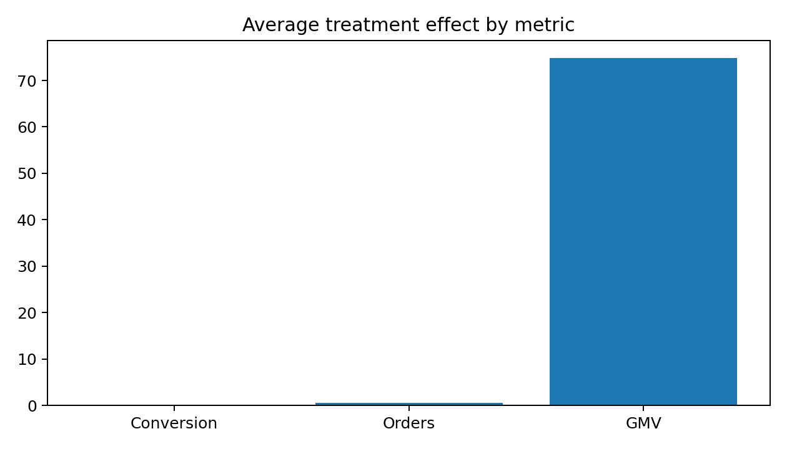
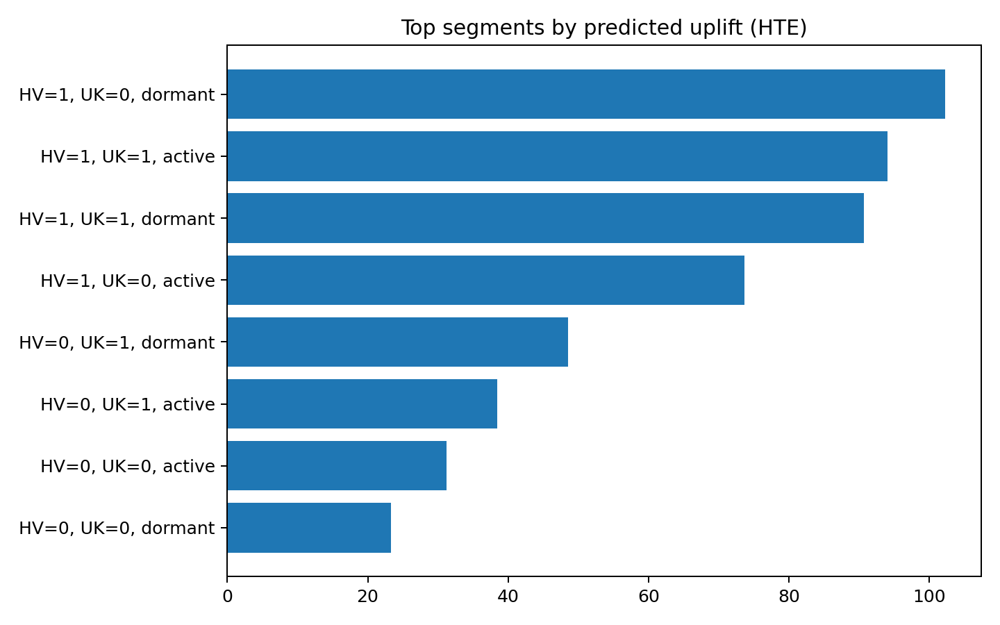

# A/B Testing and Causal Inference for Coupon Targeting  
# 优惠券投放策略的 A/B Test 与因果推断分析

An end-to-end experimentation and causal inference project built on customer-level retail transaction data.  
基于客户级零售交易数据构建的端到端实验分析与因果推断项目。

---

## 1. Project Overview | 项目简介

### English
This project evaluates a coupon-targeting strategy through a complete analytics workflow, including:

- experiment design and power analysis
- A/B test diagnostics and treatment effect estimation
- CUPED-based variance reduction
- heterogeneous treatment effect (HTE) analysis
- observational causal inference with AIPW

The project is designed as a portfolio-ready data analytics internship project, with a stronger industry-style narrative than a purely academic causal inference notebook.

### 中文
本项目围绕“优惠券投放策略是否有效”这一业务问题，构建了一条完整的数据分析与因果推断链路，包括：

- 实验设计与功效分析
- A/B test 质检与处理效应估计
- 基于 CUPED 的方差缩减
- 异质性处理效应（HTE）分析
- 基于 AIPW 的观察性因果推断

项目目标是做成一个更贴近真实工业场景的作品集项目，用于投递数据分析/数据科学相关实习，而不仅仅是一个理论性的因果推断 notebook。

---

## 2. Business Question | 业务问题

### English
Should a coupon-targeting strategy be rolled out to users?  
If yes, should it be launched to the full population or targeted to specific user segments?

### 中文
优惠券投放策略是否值得上线？  
如果值得上线，应该全量投放，还是只对特定用户群体进行定向投放？

---

## 3. Data Source | 数据来源

### English
This project uses the **UCI Online Retail** dataset as the behavioral base and constructs a customer-level experiment table for downstream analysis.

- Raw file used locally: `data/raw/Online Retail.xlsx`
- The original dataset contains transaction-level retail records.
- The project transforms raw transactions into customer-level features, pre-period metrics, post-period outcomes, randomized treatment assignments, and an observational policy-targeted treatment flag.

### 中文
本项目以 **UCI Online Retail** 数据集作为行为数据底座，并基于原始交易记录构造客户级实验分析表。

- 本地使用的原始文件：`data/raw/Online Retail.xlsx`
- 原始数据为交易级零售记录
- 项目会将其处理成客户级别的分析数据，包括实验前行为特征、实验后结果指标、随机实验 treatment，以及观察性场景中的策略性投放标记

---

## 4. Project Structure | 项目结构

```text
ab_causal_internship_project/
├── data/
│   ├── raw/
│   │   └── Online Retail.xlsx
│   └── processed/
│       └── customer_experiment_table.csv
├── docs/
│   └── resume_bullets.md
├── results/
│   ├── design_power_summary.json
│   ├── ab_test_results.json
│   ├── cuped_results.json
│   ├── hte_summary.json
│   ├── hte_scored_users.csv
│   ├── observational_results.json
│   ├── ate_bar.png
│   └── hte_top_segments.png
├── sql/
│   └── metrics.sql
├── src/
│   ├── 01_prepare_data.py
│   ├── 02_design_and_power.py
│   ├── 03_ab_test_analysis.py
│   ├── 04_cuped.py
│   ├── 05_hte.py
│   ├── 06_observational.py
│   ├── 07_make_figures.py
│   ├── config.py
│   ├── run_all.py
│   └── utils.py
├── requirements.txt
└── README.md
```

---

## 5. Methodology | 方法流程

### 5.1 Data Preparation | 数据准备

### English

The raw retail transactions are cleaned and aggregated into a customer-level analysis table.
The preparation step includes:
-	removing invalid transactions
-	filtering missing customer IDs
-	constructing pre-period user features
-	constructing post-period outcomes
-	creating randomized treatment for A/B testing
-	creating policy-targeted treatment for observational causal analysis

### 中文

项目首先对原始零售交易数据进行清洗，并聚合成客户级分析表。主要步骤包括：
-	清除无效交易
-	去除缺失客户 ID 的记录
-	构造实验前行为特征
-	构造实验后结果指标
-	生成随机实验 treatment
-	构造观察性场景下的策略性投放 treatment


### 5.2 Experiment Design and Power Analysis | 实验设计与功效分析

### English

The project estimates baseline metrics and minimum detectable effects (MDE) based on the available customer sample.
The primary metric is 30-day conversion, with orders and GMV as secondary metrics.

### 中文

项目基于可用客户样本估计基线指标和最小可检测效果（MDE）。
主指标设为 30 日转化率，次指标包括 30 日订单数和 30 日 GMV。

---


### 5.3 A/B Test Analysis | A/B Test 主分析

### English

The A/B test module includes:
-	sample ratio mismatch (SRM) check
-	difference in proportions for conversion
-	difference in means for orders and GMV
-	p-values and confidence intervals
-	bootstrap interval estimation for GMV

### 中文

A/B Test 主分析包括：
-	SRM（样本比例失衡）检查
-	转化率的比例差估计
-	订单数和 GMV 的均值差估计
-	p-value 与置信区间
-	对 GMV 使用 bootstrap 估计区间


### 5.4 CUPED Variance Reduction | CUPED 方差缩减

### English

Pre-period revenue is used as a covariate for CUPED adjustment in order to reduce noise in GMV estimation and improve statistical sensitivity.

### 中文

项目使用实验前收入作为协变量进行 CUPED 调整，以降低 GMV 估计中的噪音并提高实验灵敏度。


### 5.5 Heterogeneous Treatment Effect (HTE) | 异质性处理效应分析

### English

A T-learner is used to estimate user-level conditional average treatment effects (CATE).
The project then summarizes which segments are predicted to benefit more from coupon targeting.

### 中文

项目采用 T-learner 估计用户级条件平均处理效应（CATE），并进一步识别哪些用户群体更可能从优惠券策略中受益。


### 5.6 Observational Causal Inference | 观察性因果推断

### English

To simulate a realistic non-randomized targeting scenario, the project constructs a policy-targeted coupon treatment flag and estimates treatment effects using AIPW.

### 中文

为了模拟真实业务中“非随机投放”的场景，项目构造了策略性优惠券投放变量，并使用 AIPW 对观察性因果效应进行估计。

---


## 6. Key Results | 核心结果

### English

Based on the current run of the project:
-	The A/B test showed a statistically significant positive lift in 30-day conversion, orders, and GMV.
-	The experiment passed the SRM check with p ≈ 0.293, suggesting no evidence of sample-ratio mismatch.
-	The treatment increased 30-day conversion by about 10 percentage points relative to control.
-	CUPED reduced GMV variance by about 33%, while the treatment effect remained statistically significant.
-	HTE analysis suggested that uplift was not uniform across the user base. Some high-value and relatively dormant segments had substantially higher predicted gains.
-	In the observational coupon-targeting scenario, the naive treated-vs-control difference was about 86.50, while the AIPW estimate was about 58.92, illustrating selection bias under non-randomized targeting.

### 中文

根据本项目当前运行结果：
-	A/B 实验显示实验组在 30 日转化率、订单数和 GMV 上均有显著正向提升。
-	SRM 检查通过，p ≈ 0.293，未发现明显分流异常。
-	实验组相较对照组，30 日转化率提升约 10 个百分点。
-	使用 CUPED 后，GMV 方差下降约 33%，且处理效应仍显著为正。
-	HTE 分析表明 uplift 并不是均匀分布在所有用户中的，部分高价值、相对沉睡用户的预测收益更高。
-	在观察性优惠券投放场景下，朴素处理组-对照组差值约为 86.50，而 AIPW 估计约为 58.92，表明非随机投放会导致效果被高估。

---


## 7. Visual Results | 可视化结果

### English

The project generates the following key figures:
-	results/ate_bar.png: estimated treatment effect across conversion, orders, and GMV
-	results/hte_top_segments.png: top user segments ranked by predicted uplift

### 中文

项目生成了以下关键图表：
-	results/ate_bar.png：不同指标上的平均处理效应柱状图
-	results/hte_top_segments.png：按预测 uplift 排序的高收益用户群图

Example figure references | 图表示例引用




---


## 8. Business Recommendation | 业务建议

### English

The coupon strategy appears worth rolling out, but the results suggest that targeted deployment is more appropriate than uniform rollout.

Why:
-	the average treatment effect is positive
-	uplift is concentrated in specific segments
-	naive observational comparisons overestimate impact under non-randomized targeting

### 中文

优惠券策略整体上值得上线，但从项目结果看，更适合做定向投放，而不是面向全量用户无差别上线。

原因包括：
-	平均处理效应为正
-	uplift 主要集中在部分用户群
-	在非随机投放场景下，朴素均值差会高估真实效果

---


## 9. How to Run | 运行方式

### 9.1 Install dependencies | 安装依赖

```pip install -r requirements.txt```

### 9.2 Prepare data | 准备数据

Put the raw file here | 将原始数据放到这里：

```data/raw/Online Retail.xlsx```

Then run:

```python src/01_prepare_data.py```

9.3 Run analysis modules one by one | 分步运行

```python src/02_design_and_power.py
python src/03_ab_test_analysis.py
python src/04_cuped.py
python src/05_hte.py
python src/06_observational.py
python src/07_make_figures.py
```
9.4 Or run all at once | 一键运行

```python src/run_all.py```


---


## 10. Example Output Files | 输出文件说明

### English
-	customer_experiment_table.csv: customer-level experiment table
-	design_power_summary.json: baseline metrics and MDE summary
-	ab_test_results.json: A/B test main results
-	cuped_results.json: CUPED-adjusted GMV results
-	hte_summary.json: HTE summary and top segments
-	observational_results.json: AIPW and naive observational estimates
-	ate_bar.png: visualization of average treatment effects
-	hte_top_segments.png: visualization of high-uplift segments

### 中文
-	customer_experiment_table.csv：客户级实验分析表
-	design_power_summary.json：基线指标与 MDE 汇总
-	ab_test_results.json：A/B 实验主结果
-	cuped_results.json：CUPED 调整后的 GMV 结果
-	hte_summary.json：HTE 汇总及高 uplift 人群
-	observational_results.json：AIPW 与朴素观察性估计结果
-	ate_bar.png：平均处理效应可视化图
-	hte_top_segments.png：高 uplift 人群可视化图

---


## 11. Limitations | 局限性

### English
-	The project uses a public retail dataset rather than a native online experimentation dataset.
-	The experiment is partially simulated on top of real customer behavior data.
-	The HTE module uses a lightweight T-learner implementation rather than a more advanced causal forest / double ML framework.

### 中文
-	本项目使用的是公开零售数据，而非原生线上实验数据。
-	实验 treatment 和观察性投放场景是在真实行为数据基础上构造得到的。
-	HTE 模块当前采用轻量级 T-learner，而不是更复杂的 causal forest / double ML 框架。

---


## 12.  Future Improvements | 后续可扩展方向

### English
-	replace T-learner with EconML CausalForestDML or DRLearner
-	add refutation tests with DoWhy
-	build an interactive dashboard
-	test alternative targeting policies and budget constraints

### 中文
- 使用 EconML 的 CausalForestDML 或 DRLearner 替代当前 T-learner
-	使用 DoWhy 增加 refutation / robustness checks
-	构建交互式 dashboard
-	测试不同投放预算和 targeting policy 的效果

